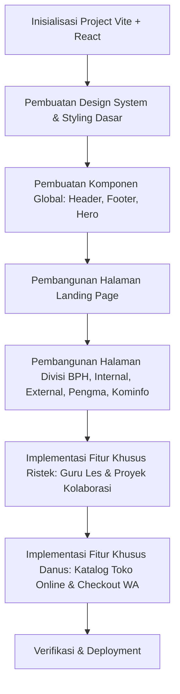

# Rencana Implementasi: Website HIMA EINSTEIN.COM (Kabinet Phótisma)

Rencana ini dibuat untuk merancang dan membangun website resmi **Himpunan Elektronika Instrumentasi Politeknik Teknologi Nuklir Indonesia** (**HIMA EINSTEIN.COM**) dengan mengusung tema **Kabinet Phótisma**. Website ini akan dirancang dengan standar internasional, elegan, dan fungsional—terinspirasi dari konsep situs [HMTC ITS](https://hmtc-its.com/) yang modern dan dinamis.

---

## 🌟 Identitas Visual & Estetika (Tema Phótisma x Modern SaaS)
* **Karakter Desain:** Modern, Premium, & Clean SaaS/Consultancy style (terinspirasi dari konsep visual Aeline & Starlink).
* **Warna Utama:** Gradien Biru Elektrik/Cyan (`#0052FF` ke `#00D2FF`) dan Lime-Green (`#A3E635`) sebagai aksen penunjuk data. Latar belakang memadukan true dark obsidian (`#05070A`) dengan *glassmorphism* transparan bernuansa biru langit lembut.
* **Typography:** Font **Outfit** (lebar & futuristik) untuk heading utama, serta **Inter** (tipis & minimalis) untuk isi konten dan menu detail.
* **Layout Kartu & Metrik:** Desain tumpukan kartu melengkung (*curved fanned-out deck*) untuk menampilkan daftar program divisi secara dinamis, serta modul box metrik statistik bersudut melingkar (*rounded card-metric* dengan radius `16px` - `24px`) lengkap dengan avatar bulat dan angka pencapaian besar (`120+`, `100%`).

---

## 🛠️ Tech Stack & Arsitektur Kode
Untuk memudahkan kolaborasi tim dan memfasilitasi fitur-fitur interaktif (seperti katalog Danus, form registrasi Ristek, dll.), kita akan menggunakan:
1. **Frontend:** **Vite + React** (JavaScript) untuk kecepatan build, modularitas komponen, dan skalabilitas.
2. **Styling:** **Vanilla CSS / CSS Modules** untuk kontrol penuh estetika tanpa bergantung pada utility framework.
3. **Routing:** **React Router DOM** untuk navigasi multi-halaman yang mulus (Single Page Application).
4. **State Management:** React Context API (jika dibutuhkan untuk fitur keranjang belanja Danus).

---

## 📂 Fitur Utama & Struktur Halaman (7 Landing Page Dedicated)
Setiap tab pada navigasi utama akan diimplementasikan sebagai halaman (route) mandiri yang memiliki layout dan fungsionalitas khusus:

### 1. Halaman Beranda (Home)
* *Konten:* Profil lengkap HIMA, Sambutan Ketua Himpunan, Visi & Misi Kabinet Phótisma, Nilai-nilai organisasi, dan Video profil Himpunan.

### 2. Halaman Einstein Sphere (Sektor Divisi Hub)
* *Konten:* Hub khusus yang memaparkan 8 divisi kerja Himpunan (BPH, Internal, External, Ristek, Pengma, Danus, Kominfo, Logistik).
* *Fitur:* Dropdown cepat pada navbar and kartu interaktif yang meluncurkan *Console Drawer* detail program kerja masing-masing divisi dari kanan layar.

### 3. Halaman Einstein Market (Dana Usaha Store)
* *Konten:* Toko online e-commerce resmi HIMA EINSTEIN untuk penjualan merchandise eksklusif (PDH, Kaos, Jaket, Ganci).
* *Fitur:* Grid produk dinamis, Shopping Cart terintegrasi, dan tombol checkout instan terhubung ke WhatsApp.

### 4. Halaman Einstein Quest (Sejarah & Dokumentasi)
* *Konten:* Linimasa (Timeline) perjalanan Himpunan dari tahun berdiri hingga era Kabinet Phótisma.
* *Fitur:* Dokumenter sejarah interaktif, arsip foto-foto kegiatan penting, dan sorotan pencapaian Himpunan.

### 5. Halaman Einstein Space (Peminjaman Alat)
* *Konten:* Portal peminjaman instrumen laboratorium (Multimeter, Solder, Arduino Kit) milik Himpunan.
* *Fitur:* Status ketersediaan alat secara real-time (Tersedia / Dipinjam) dan form reservasi booking WhatsApp otomatis.

### 6. Halaman Sekretariat (Dokumen & Persuratan)
* *Konten:* Portal administrasi digital bagi seluruh anggota Himpunan.
* *Fitur:* Download center untuk template berkas resmi (Proposal, LPJ, Surat Undangan) dan form pengajuan nomor surat resmi ke BPH.

### 7. Halaman Einstein Kalender (Agenda Ormawa)
* *Konten:* Kalender agenda kegiatan terintegrasi bulanan.
* *Fitur:* Kalender ormawa interaktif yang menayangkan jadwal kegiatan HIMA EINSTEIN dan agenda ormawa eksternal kampus Poltek Nuklir.

---

## 📋 Tahapan Implementasi

### Fase 1: Setup Proyek & Landasan CSS
* Inisialisasi struktur folder Vite React.
* Konfigurasi `.css` global dengan variable warna (*design tokens*), tipografi, dan layout standar (*grid/flexbox*).

### Fase 2: Komponen Dasar & Landing Page
* Membuat komponen reusable: `Navbar`, `Footer`, `Button`, `Card`.
* Membuat Landing Page dengan visual premium dan animasi transisi.

### Fase 3: Halaman Divisi & Fitur Fungsional
* Membangun halaman divisi satu per satu.
* Mengintegrasikan formulir pendaftaran interaktif untuk **Ristek Mengajar** (Guru Les) dan board proyek kolaborasi.
* Membuat grid katalog produk untuk **Dana Usaha** beserta fungsi keranjang.

---

## 🧪 Rencana Verifikasi (Verification Plan)
* **Automated Linting & Build Test:** Menjalankan `npm run build` untuk memastikan tidak ada error saat kompilasi.
* **Responsive Design Testing:** Memastikan seluruh halaman tampil sempurna di perangkat Mobile, Tablet, dan Desktop.
* **Fungsionalitas Formulir & Checkout:** Menguji alur pendaftaran tutor Ristek dan checkout belanja Danus ke WhatsApp.
