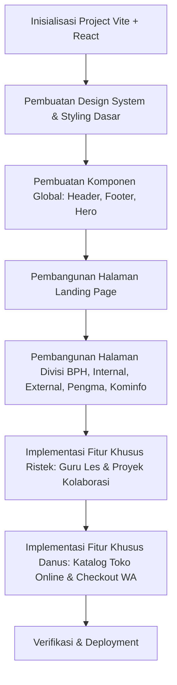

# Rencana Implementasi: Website HIMA EINSTEIN.COM (Kabinet Phótisma)

Rencana ini dibuat untuk merancang dan membangun website resmi **Himpunan Elektronika Instrumentasi Politeknik Teknologi Nuklir Indonesia** (**HIMA EINSTEIN.COM**) dengan mengusung tema **Kabinet Phótisma**. Website ini akan dirancang dengan standar internasional, elegan, dan fungsional—terinspirasi dari konsep situs [HMTC ITS](https://hmtc-its.com/) yang modern dan dinamis.

---

## 🌟 Identitas Visual & Estetika (Tema Phótisma)
* **Warna Utama:** Sleek Dark Mode (Deep Charcoal `#0B0C10`, Obsidian `#1F2833`) dipadukan dengan aksen cahaya Phótisma (Gold/Yellow `#F2A900` atau `#FFD700` melambangkan cahaya/penerangan) dan warna biru neon/cyan atomik (`#66FCF1` melambangkan elektronika instrumentasi nuklir).
* **Typography:** Menggunakan font modern dari Google Fonts seperti **Outfit** (untuk heading besar dan modern) dan **Inter** (untuk keterbacaan tinggi pada teks konten).
* **Micro-Animations:** Transisi halus pada kartu divisi, efek *hover* bernuansa *glowing*, partikel latar belakang bertema atom bergerak lambat (*floating particle backgrounds*), dan efek *glassmorphism* (UI transparan dengan blur latar belakang).

---

## 🛠️ Tech Stack & Arsitektur Kode
Untuk memudahkan kolaborasi tim dan memfasilitasi fitur-fitur interaktif (seperti katalog Danus, form registrasi Ristek, dll.), kita akan menggunakan:
1. **Frontend:** **Vite + React** (JavaScript) untuk kecepatan build, modularitas komponen, dan skalabilitas.
2. **Styling:** **Vanilla CSS / CSS Modules** untuk kontrol penuh estetika tanpa bergantung pada utility framework.
3. **Routing:** **React Router DOM** untuk navigasi multi-halaman yang mulus (Single Page Application).
4. **State Management:** React Context API (jika dibutuhkan untuk fitur keranjang belanja Danus).

---

## 📂 Fitur Utama & Pembagian Halaman Divisi

### 1. Landing Page (Beranda)
* **Hero Banner:** Efek visual partikel atom interaktif dengan slogan kabinet Phótisma.
* **Sekilas HIMA EINSTEIN & Kabinet:** Visi, misi, dan sambutan dari Ketua Himpunan.
* **Menu Cepat / Quick Access:** Navigasi cepat ke masing-masing divisi.

### 2. Halaman Divisi & Program Kerja Spesifik
Setiap divisi akan memiliki sub-page interaktif yang memaparkan profil dan program kerja unggulan mereka:

* **Badan Pengurus Harian (BPH)**
  * *Fitur:* Bagan struktur organisasi interaktif (Organizational Chart) dengan foto pengurus dan profil singkat. Timeline program kerja tahunan Himpunan.
* **Internal**
  * *Fitur Peminjaman Inventaris:* Portal peminjaman alat-alat praktikum/elektronika (multimeter, solder, kit Arduino, osiloskop portabel, dll.) milik Himpunan.
  * *Einstein Aspiration Hub:* Kotak saran dan aspirasi digital rahasia/anonim bagi pengurus dan anggota Himpunan.
  * *Apresiasi Anggota & Kalender Keakraban:* Halaman penghargaan anggota berprestasi (Member of the Month) dan jadwal kegiatan bonding internal.
* **External**
  * *Fitur:* Hub hubungan masyarakat, form pengajuan kerja sama/kunjungan industri, dan portal jejaring alumni HIMA EINSTEIN.
* **Riset dan Teknologi (Ristek)**
  * *Einstein Vault (Bank Soal & Materi):* Portal database akademis berisi materi kuliah, modul praktikum, dan bank soal Elektronika & Instrumentasi Nuklir.
  * *Fitur Ristek Mengajar & Guru Les:* Portal pendaftaran tutor (pengajar) dan pencarian guru les privat bagi mahasiswa.
  * *Fitur Project Collaboration:* Papan pengumuman proyek riset aktif (seperti IoT, robotika, instrumentasi nuklir) di mana anggota bisa mendaftar untuk berkolaborasi.
* **Pengembangan Mahasiswa (Pengma)**
  * *Fitur:* Pusat karir (informasi magang/lowongan kerja bidang nuklir/instrumentasi), kalender pelatihan kompetensi (PLC, Arduino, LabVIEW), dan galeri prestasi mahasiswa.
* **Dana Usaha (Danus)**
  * *Fitur E-Commerce/Katalog Produk:* Toko online resmi HIMA EINSTEIN. Menjual merchandise (PDH, kaos, gantungan kunci, stiker) dengan fitur keranjang belanja virtual dan checkout terintegrasi langsung ke WhatsApp Danus.
* **Kominfo**
  * *Fitur:* Feed media sosial terintegrasi (Instagram/YouTube), galeri buletin/podcast Himpunan, serta bank rilis pers resmi.

---

## 📋 Tahapan Implementasi

### Fase 1: Setup Proyek & Landasan CSS
* Inisialisasi struktur folder Vite React.
* Konfigurasi `.css` global dengan variable warna (*design tokens*), tipografi, dan layout standar (*grid/flexbox*).

### Fase 2: Komponen Dasar & Landing Page
* Membuat komponen reusable: `Navbar`, `Footer`, `Button`, `Card`.
* Membuat Landing Page dengan visual premium dan animasi transisi.

### Fase 3: Halaman Divisi & Fitur Fungsional
* Membangun halaman divisi satu per satu.
* Mengintegrasikan formulir pendaftaran interaktif untuk **Ristek Mengajar** (Guru Les) dan board proyek kolaborasi.
* Membuat grid katalog produk untuk **Dana Usaha** beserta fungsi keranjang.

---

## 🧪 Rencana Verifikasi (Verification Plan)
* **Automated Linting & Build Test:** Menjalankan `npm run build` untuk memastikan tidak ada error saat kompilasi.
* **Responsive Design Testing:** Memastikan seluruh halaman tampil sempurna di perangkat Mobile, Tablet, dan Desktop.
* **Fungsionalitas Formulir & Checkout:** Menguji alur pendaftaran tutor Ristek dan checkout belanja Danus ke WhatsApp.
